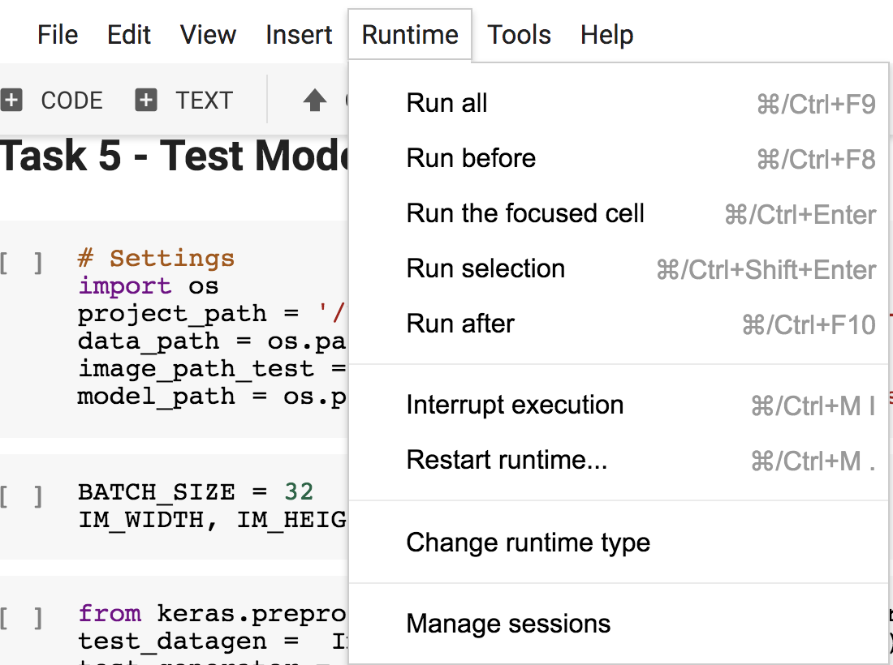
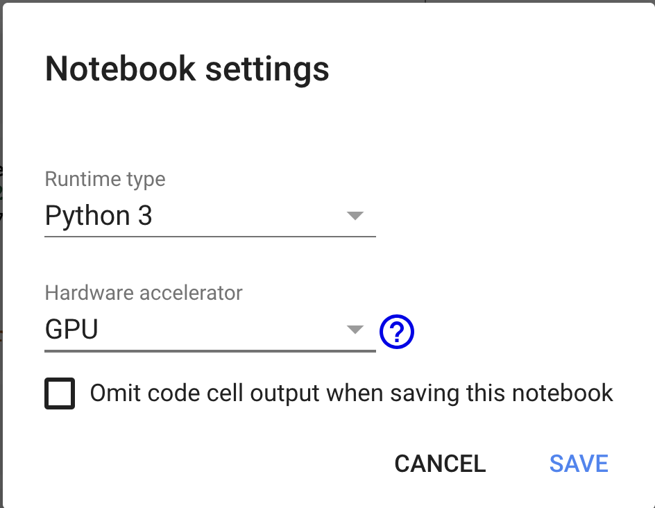
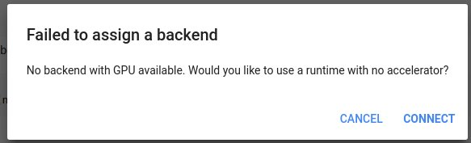

# NTUOSS Image Recognition Workshop

*by [Tu Anqi](https://github.com/anqitu) for NTU Open Source Society*

This workshop assumes beginner-level knowledge of Python.

**Disclaimer:** *This document is only meant to serve as a reference for the attendees of the workshop. It does not cover all the concepts or implementation details discussed during the actual workshop.*
___

### Workshop Details
**When**: Friday, 31 Aug 2018. 6:30 PM - 8:30 PM.</br>
**Where**: LT1 </br>
**Who**: NTU Open Source Society

### Questions
Please raise your hand any time during the workshop or email your questions to [me](mailto:anqitu@outlook.com) later.

### Errors
For errors, typos or suggestions, please do not hesitate to [post an issue](https://github.com/anqitu/NTUOSS-ImageRecognitionWorkshop/issues/new). Pull requests are very welcome! Thanks!
___

## Task 0 - Getting Started

#### 0.1 Introduction

For this tutorial, we'll be creating a Convolutional Neural Network(CNN) model with Keras on Colaboratory. The model will be able to classify the images of cat and dog.

1. What are [CNNs](https://ujjwalkarn.me/2016/08/11/intuitive-explanation-convnets/)?\
Convolutional Neural Networks (CNNs or ConvNets) are a category of [Neural Networks](https://ujjwalkarn.me/2016/08/09/quick-intro-neural-networks/) that have proven very effective in areas such as image recognition and classification. CNNs have been successful in identifying faces, objects and traffic signs apart from powering vision in robots and self driving cars.

2. What is [Keras](https://keras.io/)?\
Keras is an open source neural network library written in Python. It was developed with a focus on enabling fast experimentation.

3. What is [Colaboratory](https://colab.research.google.com/notebooks/welcome.ipynb)?\
Colaboratory is a Google research project created to help disseminate machine learning education and research. It is a free Jupyter notebook environment that requires no setup and runs entirely in the cloud.

4. What is Image Classification? [Source](https://adeshpande3.github.io/adeshpande3.github.io/A-Beginner's-Guide-To-Understanding-Convolutional-Neural-Networks/)\
Image classification is the task of taking an input image and outputting a class (a cat, dog, etc) or a probability of classes that best describes the image. When a computer sees an image (takes an image as input), it will see an array of pixel values.\
\
Depending on the resolution and size of the image, it will see a WIDTH x HEIGHT x 3 array of numbers (The 3 refers to RGB values). For example, suppose we have a colorful image in JPG format with a size 480 x 480. The  array seen by the computer will be 480 x 480 x 3. Each of these numbers is a value between 0 and 255 which describes the pixel intensity at that point. These numbers, while meaningless to us when we perform image classification, are the only inputs available to the computer.\
The idea of image classification is that, you give the computer this array of numbers, then it will output numbers that describe the probability of the image being a certain class (eg. .80 for cat, .2 for dog).


#### 0.2 Initial Setup

Add this [folder](https://drive.google.com/open?id=1uZT-vRnWgxYp9wgzYw6tTPS_lW20T9e7) to your google drive

Inside the folder, you will find 3 folders:
```
/NTUOSS-ImageRecognitionWorkshop
  /data
  /complete
  /start
```

In the /data folder, there are train, test and validation image folders, with the data distribution shown as below. To allow Keras to use its special API to handle the data downloads directly from the folder, the tructure of the project folder must be as following.
```
/data
  /train:
    /cat: 2000
    /dog: 2000
  /validation
    /cat: 1000
    /dog: 1000
  /test
    /cat: 100
    /dog: 100
```
Here are the purposes of each type of data set:
- Train: The model is initially fit on a training dataset, which is a set of examples used to fit the parameters of the model (e.g. weights of connections between neurons in neural networks). The training dataset often consists of pairs of an input vector and the corresponding target. In our case, each image is an input vector, while the image's label (dog or cat) is a target.

- Validation: Then, the fitted model is used to predict the responses for the observations in the validation dataset. The validation dataset provides an unbiased evaluation of the fitted model. It can be used for regularization by early stopping: stop training when the error on the validation dataset increases, as this is a sign of overfitting to the training dataset.

- Test: Finally, the test dataset is a dataset used to provide an unbiased evaluation of a final model fit on the training dataset.

The /complete folder contains complete codes for this project, including extracting image urls, downloading images, training model and predicting images. This workshop will focus on the model training and image recognition part. For those who are interested in how I crawl all the images from google, do take a look on the other two scripts.
```
/complete
  /model
  /0_Extract_Image_url.py
  /1a_Image_Downloader.py
  /1a_Image_Downloader.py
  /1b_Move_Kaggle_Images_To_Subfolder.py
  /3_TestModel.py
  /4_Recognize_Image.py
  /util.py
```

This /start folder contains the incomplete codes for the purpose of this workshop.
```
/start
  /Train_Model.py
  /Predict.py
```

Now, let's start by opening the Train_Model.py file: Right click Train_Model.py file -> Select 'Open with' -> Select 'Colaboratory'.


## Task 1 - Virtual Environment

#### 1.1 Change to a Free GPU Runtime
<!-- TODO: write about CPU vs GPU -->
Apart from saving us trouble in setting up environments, Colab also provides free GPU that speeds up the training and prevents your own laptop from overheating.

Select "Runtime," "Change runtime type,".




On this pop-up, select GPU.



Ensure "Hardware accelerator" is set to GPU (the default is CPU). Afterward, ensure that you are connected to the runtime (there is a green check next to "connected" in the menu ribbon).

[screenshots/task_1_1_c.png](screenshots/task_1_1_c.png)

To check whether you have a visible GPU (i.e. you are currently connected to a GPU instance), run the following code.
```python
# Task 1.1: Check if you are currently using the GPU in Colab
import tensorflow as tf
tf.test.gpu_device_name()
```

If you are connected, here is the response:
```
'/device:GPU:0'
```
And there you go. This allows you to access a free GPU for up to 12 hours at a time.

Alternatively, supply and demand issues may lead to this:

{:height="36px" width="36px"}

You will need to try again later to see whether there is any available free GPU. Don't worry even if you do not have the access to an available GPU now, as I will explain later.


#### 1.2 Mount Google Drive

To import tha data into the VM, we will mount the google drive on the machine using `google-drive-ocamlfuse`. ([Reference](https://gist.github.com/Joshua1989/dc7e60aa487430ea704a8cb3f2c5d6a6))

```python
# Task: 1.2.1 Install google-drive-ocamlfuse
!apt-get install -y -qq software-properties-common python-software-properties module-init-tools
!add-apt-repository -y ppa:alessandro-strada/ppa 2>&1 > /dev/null
!apt-get update -qq 2>&1 > /dev/null
!apt-get -y install -qq google-drive-ocamlfuse fuse
```

Then, authenticate and get credentials for your google drive.
```python
# Task: 1.2.2 Authenticate and get credentials
from google.colab import auth
auth.authenticate_user()
from oauth2client.client import GoogleCredentials
creds = GoogleCredentials.get_application_default()

import getpass
!google-drive-ocamlfuse -headless -id={creds.client_id} -secret={creds.client_secret} < /dev/null 2>&1 | grep URL
vcode = getpass.getpass()
!echo {vcode} | google-drive-ocamlfuse -headless -id={creds.client_id} -secret={creds.client_secret}
```
At this step you will be asked two times to authenticate the access to your drive, at each step a token will be generated:
- Click on the link to log into your google account.
- Allow access to your drive.
- Copy the token (The token looks like this - 4/PABmEY7BRPd3jPR9BI9I4R99gc9QITTYFUVDU76VR) Press Enter
- Switch to the notebook to paste the token in the 'Enter verification code' bar.
- Press 'Enter'

And then you can finally mount your google drive.
```python
# TASK 1.2.3: Mount Google Drive in local Colab VM
!mkdir -p drive
!google-drive-ocamlfuse drive
!ls
```

You should see a /drive folder inside the current working directory. Running the code below should let you see the folders inside your google drive.
```python
!ls drive
```

Then, access out working directory /drive/NTUOSS-ImageRecognitionWorkshop. Running the code below should let you access the working directory of this workshop.
```python
!ls drive/NTUOSS-ImageRecognitionWorkshop
```

Lastly, check the /data directory.
```python
!ls drive/NTUOSS-ImageRecognitionWorkshop/data
```


## Task 2 - Preprocess Images

#### 2.1 Configure Image Augmentation
<!-- TODO: image augmentation -->
Data generator for train set includes augmentation and processing (shear, zoom, horizontal_flip, rescale).
```python
# TASK 2.1 : Add augmentation configuration for the data generator of train data only
datagen_train =  ImageDataGenerator(
    rescale=1. / 255,
    rotation_range=30,
    width_shift_range=0.2,
    height_shift_range=0.2,
    zoom_range=0.2,
    horizontal_flip=True)
```

#### 2.2 Generate Image Data from Directory
Now, let's create the data generator generators which use .flow_from_directory() to generate batches of image data (and their labels) directly from our jpgs in their respective folders.

Also it is time to put some additional parameters, like class_mode, target_size and batch_size.
- **directory**: Path to the target directory. It should contain one subdirectory per class
- **target_size**: As all images from our data set has different resolution and pixels, we need to standardize the image size when feeding our model. The target_size is the size of your input images, every image will be resized to this size.
- **class_mode**: Set as binary since the model is trained to classify whether the image is a cat a dog, which is a yes/no question. If the model is trained on classifying more than 2 categories, the class mode should be set to 'categorical'.
- **shuffle**: Whether to shuffle the data. Set True if you want to shuffle the order of the image that is being yielded, else set False.
- **batch_size**: Here we also need to explain on the concept of epoch, batch size and iteration:\
`one epoch` = one forward pass and one backward pass of all the training samples.\
`batch size` = the number of training samples in one forward/backward pass. Each batch size will be used to update the model parameters. (Ideally, you would want to use all the training samples to calculate the gradients for every single update, however that is not efficient. The higher the batch size, the more memory space you'll need. The batch size will simplify the process of updating the parameters. Usually, a batch size of 64, 128 and 256 are used.)\
`number of iterations` = number of passes. Each pass using the batch size number of examples.\
`One pass` = one forward pass + one backward pass.\
For instance, here we have 4000 training samples and we set the batch_size equal to 50. The first 50 samples (from 1st to 50) from the training dataset will be used to train the network. Then it takes second 50 samples (from 51st to 100th) and train network again. This procedure continues until all samples have been propagated through the networks. In total, there will be 4000/50 = 80 iterations for each epoch.
For more details about other parameters, please check [Keras documentation](https://keras.io/preprocessing/image/)


```python
# TASK 2.2 : Generate Image Data from Directory and Set parameter
train_data = datagen_train.flow_from_directory(
    directory = './drive/NTUOSS-ImageRecognitionWorkshop/data/train',
    target_size = (150, 150),
    class_mode = 'binary',
    shuffle=True,
    batch_size = 50)
validation_data = datagen_val.flow_from_directory(
    directory = './drive/NTUOSS-ImageRecognitionWorkshop/data/validation',
    target_size = (150, 150),
    class_mode = 'binary',
    shuffle=True,
    batch_size = 50)
```

As we have 2000 images of each class for train set and 1000 images of each class for validation set, you should see this response:
```
Found 4000 images belonging to 2 classes.
Found 2000 images belonging to 2 classes.
```

Then, running the code below will let you see the class indices of the data generator.
```python
# TASK 2.2.2 : Check class indices
print('Class Indices : {}'.format(train_data.class_indices))
```

You will see the response as below.
```
Class Indices : {'cat': 0, 'dog': 1}
```
This class indices imply that, ideally, the model will predict the image as 0 if it is cat, and predict the image as 1 if it is a dog. However, the model will only be able to predict the probability of whether the image is a cat or a dog. Thus, the closer the probability to 0, the higher the confidence that the image is a cat. The closer the probability to 1, the higher the confidence that the image is a dog. For example, a probability of 0.8 indicates a dog, while a probability of 0.2 indicates a cat.


## Task 3 - Build Basic Model

#### 3.1 Set up backend and Import libraries
<!-- TODO: backend -->

```python
# TASK 3.1.1 Configure backend
from keras import backend as K
K.set_image_data_format('channels_last')
K.set_image_dim_ordering('tf') #channel last
```

```python
# TASK 3.1.2 Import the Keras libraries and packages
from keras.models import Sequential
from keras.layers import Conv2D, MaxPooling2D, Flatten, Dense
```

<!-- TODO: Cnov/Relu/Pooling -->

We’ve imported Conv2D from keras.layers, this is to perform the convolution operation i.e the first step of a CNN, on the training images. Since we are working on images here, which a basically 2 Dimensional arrays, we’re using Convolution 2-D,

We’ve imported MaxPooling2D from keras.layers, which is used for pooling operation, that is the step — 2 in the process of building a cnn. For building this particular neural network, we are using a Maxpooling function, there exist different types of pooling operations like Min Pooling, Mean Pooling, etc. Here in MaxPooling we need the maximum value pixel from the respective region of interest.

We’ve imported Flatten from keras.layers, which is used for Flattening. Flattening is the process of converting all the resultant 2 dimensional arrays into a single long continuous linear vector.

We’ve imported Dense from keras.layers, which is used to perform the full connection of the neural network, which is the step 4 in the process of building a CNN.

Let's build our first model, a simple stack of 3 convolution layers with a ReLU activation and followed by max-pooling layers

#### 3.2 Construct Model
```python
# TASK 3.2.1 Initialise Neural Network Model
model = Sequential()
```

```python
# TASK 3.2.2 Create first set of CONV -> RELU -> POOL layers
model.add(Conv2D(32, (3, 3), activation='relu', input_shape=(150, 150, 3)))
model.add(MaxPooling2D(pool_size=(2, 2)))
```

```python
# TASK 3.2.3 Create second set of CONV -> RELU -> POOL layers
model.add(Conv2D(64, (3, 3), activation='relu'))
model.add(MaxPooling2D(pool_size=(2, 2)))
```

```python
# TASK 3.2.4 Create third set of CONV -> RELU -> POOL layers
model.add(Conv2D(64, (3, 3), activation='relu'))
model.add(MaxPooling2D(pool_size=(2, 2)))
```

```python
# TASK 3.2.5 Convert the 3D feature maps to 1D feature vectors
model.add(Flatten())
```

<!-- TODO: output one node -->
The output layer should contain only one node, as it is binary classification.
```python
# TASK 3.2.6 Add the connection and output layer
model.add(Dense(256, activation='relu'))
model.add(Dense(1, activation = 'sigmoid'))
```

Lastly, compile the model.
<!-- TODO: loss/optimizer/metrics -->
```python
# TASK 3.2.7 Compile the model
model.compile(loss='binary_crossentropy', optimizer='rmsprop', metrics=['accuracy'])
```

#### 3.3 Check Model

```python
# TASK 3.3 Check the model structure.
model.summary()
```
You will see the structure of model as below if you follow all steps correctly so far.
```
_________________________________________________________________
Layer (type)                 Output Shape              Param #   
=================================================================
conv2d_1 (Conv2D)            (None, 148, 148, 32)      896       
_________________________________________________________________
max_pooling2d_1 (MaxPooling2 (None, 74, 74, 32)        0         
_________________________________________________________________
conv2d_2 (Conv2D)            (None, 72, 72, 64)        18496     
_________________________________________________________________
max_pooling2d_2 (MaxPooling2 (None, 36, 36, 64)        0         
_________________________________________________________________
conv2d_3 (Conv2D)            (None, 34, 34, 64)        36928     
_________________________________________________________________
max_pooling2d_3 (MaxPooling2 (None, 17, 17, 64)        0         
_________________________________________________________________
flatten_1 (Flatten)          (None, 18496)             0         
_________________________________________________________________
dense_1 (Dense)              (None, 256)               4735232   
_________________________________________________________________
dense_2 (Dense)              (None, 1)                 257       
=================================================================
Total params: 4,791,809
Trainable params: 4,791,809
Non-trainable params: 0
_________________________________________________________________
```

## Task 4 - Train Model
<!-- TODO: fit_generator -->
<!-- TODO: epoch -->
<!-- TODO: EarlyStopping -->
<!-- TODO: validation -->
<!-- TODO: save model -->

```python
# TASK 4: Train Model
import time
train_start_time = time.time()

from keras.callbacks import EarlyStopping
EPOCHS = 25
model.fit_generator(
    generator = train_data,
    epochs = EPOCHS,
    callbacks = [EarlyStopping(monitor='val_loss', patience=2, verbose=0)],
    validation_data = validation_data)
model.save('./drive/NTUOSS-ImageRecognitionWorkshop/cnn_model_basic.h5') # save model
print("It takes {:.2f} min to train the model".format((time.time() - train_start_time)/60 ))
```

You will see the model training progress as below.
```
Epoch 1/25
80/80 [==============================] - 3899s 49s/step - loss: 0.7659 - acc: 0.5497 - val_loss: 0.8040 - val_acc: 0.5170
Epoch 2/25
80/80 [==============================] - 74s 930ms/step - loss: 0.6696 - acc: 0.5888 - val_loss: 0.6717 - val_acc: 0.5840
Epoch 3/25
80/80 [==============================] - 76s 945ms/step - loss: 0.6405 - acc: 0.6343 - val_loss: 0.6078 - val_acc: 0.6805
Epoch 4/25
80/80 [==============================] - 78s 976ms/step - loss: 0.6295 - acc: 0.6510 - val_loss: 0.6095 - val_acc: 0.6760
Epoch 5/25
80/80 [==============================] - 77s 963ms/step - loss: 0.6258 - acc: 0.6650 - val_loss: 0.5453 - val_acc: 0.7240
Epoch 6/25
80/80 [==============================] - 74s 926ms/step - loss: 0.6025 - acc: 0.6703 - val_loss: 0.6343 - val_acc: 0.6390
Epoch 7/25
80/80 [==============================] - 74s 925ms/step - loss: 0.5982 - acc: 0.6875 - val_loss: 0.5321 - val_acc: 0.7360
Epoch 8/25
80/80 [==============================] - 73s 918ms/step - loss: 0.5880 - acc: 0.6948 - val_loss: 0.5221 - val_acc: 0.7485
Epoch 9/25
80/80 [==============================] - 75s 936ms/step - loss: 0.5612 - acc: 0.7093 - val_loss: 0.5522 - val_acc: 0.7185
Epoch 10/25
80/80 [==============================] - 74s 919ms/step - loss: 0.5626 - acc: 0.7087 - val_loss: 0.5210 - val_acc: 0.7410
Epoch 11/25
80/80 [==============================] - 73s 916ms/step - loss: 0.5476 - acc: 0.7208 - val_loss: 0.5311 - val_acc: 0.7445
Epoch 12/25
80/80 [==============================] - 74s 923ms/step - loss: 0.5380 - acc: 0.7285 - val_loss: 0.5119 - val_acc: 0.7515
Epoch 13/25
80/80 [==============================] - 73s 917ms/step - loss: 0.5444 - acc: 0.7278 - val_loss: 0.5058 - val_acc: 0.7645
Epoch 14/25
80/80 [==============================] - 75s 933ms/step - loss: 0.5301 - acc: 0.7298 - val_loss: 0.4769 - val_acc: 0.7860
Epoch 15/25
80/80 [==============================] - 73s 918ms/step - loss: 0.5304 - acc: 0.7280 - val_loss: 0.4607 - val_acc: 0.7900
Epoch 16/25
80/80 [==============================] - 73s 918ms/step - loss: 0.5227 - acc: 0.7420 - val_loss: 0.5298 - val_acc: 0.7335
Epoch 17/25
80/80 [==============================] - 74s 922ms/step - loss: 0.5204 - acc: 0.7395 - val_loss: 0.4897 - val_acc: 0.7775
It takes 84.95 min to train the model
```

For your information, it took me 84.95 min to train the model. Thus, I suggest you to use the trained model inside the model folder for the rest of the workshop, and try training your own model when you go back home.

## Task 5 - Test Model
#### 5.1 Generate Test Image Data from Directory
The setting for test data generator is has same target_size as train generator settings, but different directory path, class mode, shuffle choice and batch_size.
- **rescale**: For the test set, only rescale should be made because we don't want to mess with new data and just predict its class.
- **directory**: The directory should be set to as the test data folder.
- **class_mode**: Set this to None, to return only the images.
- **shuffle**: Set this to False, because you will need to yield the images in order, to predict the outputs and match them with their filenames.
- **batch_size**: For train and validation data, it was set to be 50 which divides by 2000. For test data, set this to some number that divides your total number of images in your test set exactly.\
Why this only for test_generator?\
Actually, we should also set the “batch_size” in both train and validation generators to some number that divides your total number of images in your train set and valid respectively, but this doesn’t matter before because even if batch_size doesn’t match the number of samples in the train or valid sets and some images gets missed out every time we yield the images from generator, it would be sampled during the very next epoch.
But for the test set, you should sample the images exactly once, no less or no more. To avoid confusion, here we just set it to 1 (or any number then divides the total number of test images).


```python
# TASK 5.1.1: Set up data generator for test data
from keras.preprocessing.image import ImageDataGenerator
test_datagen = ImageDataGenerator(rescale=1. / 255)

test_data = datagen_test.flow_from_directory (
    directory = './drive/NTUOSS-ImageRecognitionWorkshop/data/test',
    target_size = (150, 150),
    class_mode=None,
    shuffle=False,
    batch_size = 200)
```

```
Found 200 images belonging to 2 classes.
```

```python
# TASK 5.1.2: Check test generator
print(test_data.class_indices)
print(test_data.filenames)
```

```
{'cat': 0, 'dog': 1}
['cat/cat.1029.jpg', 'cat/cat.10603.jpg', 'cat/cat.10629.jpg', ...'dog/dog.756.jpg', 'dog/dog.779.jpg', 'dog/dog.87.jpg']
```

#### 5.2 Load Model

```python
# TASK 5.2: Load trained model
from keras.models import load_model
model_basic = load_model('./drive/NTUOSS-ImageRecognitionWorkshop/data/model/cnn_model_basic.h5')
```

#### 5.3 Make Prediction

```python
# TASK 5.3.1: Use model to yield probability prediction for test data
probabilities = model_basic.predict_generator(test_data)
print(probabilities)
```

```
[[0.14854874]
 [0.74102986]
 [0.64901006]
 [0.15210968]
 [0.4738573 ]
 ...
 ...
 [0.4409498 ]
 [0.9367852 ]
 [0.9622177 ]
 [0.607676  ]]
```

```python
# TASK 5.3.2: Process probabilities to get prediction result
y_pred = probabilities > 0.5
print(y_pred)
```

```
[[False]
 [ True]
 [ True]
 [False]
 [False]
 ...
 ...
 [ True]
 [False]
 [ True]
 [ True]
 [ True]]
```

```python
# TASK 5.3.3: Prepare true result using folder name in filenames
y_true = [0 if 'cat' in filename else 1 for filename in test_data.filenames]
print(y_true)
```

```
[0, 0, 0, 0, 0, 0, 0,... 1, 1, 1, 1]
```


```python
# TASK 5.3.4: Calculate accuracy score
from sklearn.metrics import accuracy_score
print(accuracy_score(y_true, y_pred))
```

```
0.77
```


```python
# TASK 5.3.5: Construct a confusion matrix
from sklearn.metrics import confusion_matrix
print(confusion_matrix(y_true, y_pred))
```

```
[[65 35]
 [11 89]]
```


## Task 6 - Recognize Image with Basic Model

#### 6.1 Useful Functions

```python
# TASK 6.1.1: Define a function for reading image from url
def read_image_from_url(url):
    try:
        import requests, io
        from PIL import Image
        r = requests.get(url, timeout=15)
        img = Image.open(io.BytesIO(r.content))
        return img
    except:
        print("{:<10} Cannot find image from {}".format('[ERROR]', url))
        exit(1)
```


```python
# TASK 6.1.2: Define a function for preprocessing image
def preprocess_image(img, target_size):
    from PIL import Image
    import numpy as np
    from keras.preprocessing.image import img_to_array
    img = img.resize(target_size,Image.ANTIALIAS)
    img = img_to_array(img)
    img = np.expand_dims(img, axis=0)
    img = img.astype('float32')
    img /= 255
    return img

```


```python
# TASK 6.1.3: Define a function for processing result
def process_result(prob):
    return 'dog' if prob >=0.5 else 'cat'
```

#### 6.2 Make Prediction

```python
# TASK 6.2: Read image, Preprocess image, and Make prediction
image = read_image_from_url('https://www.readersdigest.ca/wp-content/uploads/2011/01/4-ways-cheer-up-depressed-cat.jpg') # replace with any image url
image = preprocess_image(image, (150, 150))
prob = model_basic.predict(image)
print('Probability: ' + str(prob))
print('Class: ' + process_result(prob))
```

```
Probability: [[0.3044719]]
Class: cat
```

## Task 7 - Build on Top of Pretrained Model

#### 7.1 Set up backend and Import libraries

```python
# TASK 7.1.1 Configure backend
from keras import backend as K
K.set_image_data_format('channels_last')
K.set_image_dim_ordering('tf') #channel last
```

<!-- TODO: bottle neck -->

```python
# TASK 7.1.2 Import the Keras libraries and packages
from keras.applications import VGG16
from keras.layers import Dense, Dropout, Flatten
from keras.models import Model
```

```
Downloading data from https://github.com/fchollet/deep-learning-models/releases/download/v0.1/vgg16_weights_tf_dim_ordering_tf_kernels_notop.h5
58892288/58889256 [==============================] - 6s 0us/step
```

#### 7.2 Construct Model

```python
# TASK 7.2.1: Load base model
base_model = VGG16(include_top=False, weights='imagenet', input_shape=(150, 150, 3))
```

```python
# TASK 7.2.2: Add new layers
x = base_model.output
x = Flatten()(x)
x = Dense(256, activation='relu')(x) #new FC layer, random init
x = Dropout(0.4)(x)
predictions = Dense(1, activation='sigmoid')(x)
model = Model(inputs=base_model.input, outputs=predictions)
```

```python
# TASK 7.2.3: Setup trainable layer
for layer in base_model.layers:
    layer.trainable = False
model.compile(loss='binary_crossentropy', optimizer='rmsprop', metrics=['accuracy'])
print("{:<10} Pretrained model layers: {}".format('[INFO]', len(base_model.layers)))
print("{:<10} Total number of layers : {}".format('[INFO]', len(model.layers)))
```


```
[INFO]     Pretrained model layers: 19
[INFO]     Total number of layers : 23
```

#### 7.3 Check Model

```python
# TASK 7.3: Check Model
model.summary()
```

```
_________________________________________________________________
Layer (type)                 Output Shape              Param #   
=================================================================
input_2 (InputLayer)         (None, 150, 150, 3)       0         
_________________________________________________________________
block1_conv1 (Conv2D)        (None, 150, 150, 64)      1792      
_________________________________________________________________
block1_conv2 (Conv2D)        (None, 150, 150, 64)      36928     
_________________________________________________________________
block1_pool (MaxPooling2D)   (None, 75, 75, 64)        0         
_________________________________________________________________
block2_conv1 (Conv2D)        (None, 75, 75, 128)       73856     
_________________________________________________________________
block2_conv2 (Conv2D)        (None, 75, 75, 128)       147584    
_________________________________________________________________
block2_pool (MaxPooling2D)   (None, 37, 37, 128)       0         
_________________________________________________________________
block3_conv1 (Conv2D)        (None, 37, 37, 256)       295168    
_________________________________________________________________
block3_conv2 (Conv2D)        (None, 37, 37, 256)       590080    
_________________________________________________________________
block3_conv3 (Conv2D)        (None, 37, 37, 256)       590080    
_________________________________________________________________
block3_pool (MaxPooling2D)   (None, 18, 18, 256)       0         
_________________________________________________________________
block4_conv1 (Conv2D)        (None, 18, 18, 512)       1180160   
_________________________________________________________________
block4_conv2 (Conv2D)        (None, 18, 18, 512)       2359808   
_________________________________________________________________
block4_conv3 (Conv2D)        (None, 18, 18, 512)       2359808   
_________________________________________________________________
block4_pool (MaxPooling2D)   (None, 9, 9, 512)         0         
_________________________________________________________________
block5_conv1 (Conv2D)        (None, 9, 9, 512)         2359808   
_________________________________________________________________
block5_conv2 (Conv2D)        (None, 9, 9, 512)         2359808   
_________________________________________________________________
block5_conv3 (Conv2D)        (None, 9, 9, 512)         2359808   
_________________________________________________________________
block5_pool (MaxPooling2D)   (None, 4, 4, 512)         0         
_________________________________________________________________
flatten_3 (Flatten)          (None, 8192)              0         
_________________________________________________________________
dense_5 (Dense)              (None, 256)               2097408   
_________________________________________________________________
dropout_2 (Dropout)          (None, 256)               0         
_________________________________________________________________
dense_6 (Dense)              (None, 1)                 257       
=================================================================
Total params: 16,812,353
Trainable params: 2,097,665
Non-trainable params: 14,714,688
_________________________________________________________________
```

## Task 8 - Train Advanced Model
```python
# TASK 8: Train advanced model.
EPOCHS = 25

import time
train_start_time = time.time()

from keras.callbacks import EarlyStopping

model.fit_generator(
    train_data,
    epochs=25,
    callbacks = [EarlyStopping(monitor='val_loss', patience=2, verbose=0)],
    validation_data = validation_data)
model.save('./drive/NTUOSS-ImageRecognitionWorkshop/cnn_model_advanced.h5')

print("It takes {:.2f} min to train the model".format((time.time() - train_start_time)/60 ))
```


```
Epoch 1/25
80/80 [==============================] - 88s 1s/step - loss: 0.8231 - acc: 0.6978 - val_loss: 0.3416 - val_acc: 0.8390
Epoch 2/25
80/80 [==============================] - 79s 984ms/step - loss: 0.4639 - acc: 0.7767 - val_loss: 0.3518 - val_acc: 0.8345
Epoch 3/25
80/80 [==============================] - 79s 993ms/step - loss: 0.4175 - acc: 0.8007 - val_loss: 0.2483 - val_acc: 0.8980
Epoch 4/25
80/80 [==============================] - 79s 982ms/step - loss: 0.3830 - acc: 0.8240 - val_loss: 0.2786 - val_acc: 0.8740
Epoch 5/25
80/80 [==============================] - 79s 981ms/step - loss: 0.3834 - acc: 0.8265 - val_loss: 0.2862 - val_acc: 0.8760
It takes 7.12 min to train the model
```

## Task 9 - Test Advanced Model
#### 9.1 Generate Test Image Data from Directory
```python
# TASK 9.1: Set up data generator for test data
# TASK 9.1.1 : Set up data generator for test data
from keras.preprocessing.image import ImageDataGenerator
datagen_test = ImageDataGenerator(rescale=1. / 255)

test_data = datagen_test.flow_from_directory (
    directory = './drive/NTUOSS-ImageRecognitionWorkshop/data/test',
    target_size = (150, 150),
    class_mode=None,
    shuffle=False, # keep data in same order as labels
    batch_size = 200)
```

```
Found 200 images belonging to 2 classes.
```

```python
# TASK 9.1.2: Check test generator
print(test_data.class_indices)
print(test_data.filenames)
```

#### 9.2 Load Model

```python
# TASK 9.2: Load trained model
from keras.models import load_model
model_advanced = load_model('./drive/NTUOSS-ImageRecognitionWorkshop/data/model/cnn_model_advanced.h5')
```

#### 9.3 Make Prediction
```python
# TASK 9.3.1: Use model to yield probability prediction for test data
probabilities = model_advanced.predict_generator(test_data)
print(probabilities)
```

```
[[8.9933887e-02]
 [5.1956624e-01]
 [5.7828718e-01]
 [1.5706860e-01]
 [1.7410269e-01]
 ...
 ...
 [9.3232280e-01]
 [9.6970761e-01]
 [9.9898058e-01]
 [9.9089313e-01]
 [9.9960285e-01]]
```


```python
# TASK 9.3.2: Process probabilities to get prediction result
y_pred = probabilities > 0.5
print(y_pred)
```

```
[[False]
 [ True]
 [ True]
 [False]
 ...
 ...
 [ True]
 [ True]
 [ True]
 [ True]]
```

```python
# TASK 9.3.3: Prepare true result using folder name in filenames
y_true = [0 if 'cat' in filename else 1 for filename in test_data.filenames]
print(y_true)
```

```
[0, 0, 0, 0, 0, 0, 0, 0... 1, 1, 1, 1, 1]
```

```python
# TASK 9.3.4: Calculate accuracy score
from sklearn.metrics import accuracy_score
print(accuracy_score(y_true, y_pred))
```

```
0.83
```

```python
# TASK 9.3.5: Construct a confusion matrix
from sklearn.metrics import confusion_matrix
print(confusion_matrix(y_true, y_pred))
```

```
[[70 30]
 [ 4 96]]
```


## Task 10 - Recognize Image with Advanced Model

#### 10.1 Make Prediction

```python
# TASK 10.1: Read image, Preprocess image, and Make prediction
image = read_image_from_url('https://www.readersdigest.ca/wp-content/uploads/2011/01/4-ways-cheer-up-depressed-cat.jpg') # replace with any image url
image = preprocess_image(image, (150, 150))
prob = model_advanced.predict(image)
print('Probability: ' + str(prob))
print('Class: ' + process_result(prob))
```

```
Probability: [[0.18195716]]
Class: cat
```
___

## Acknowledgements

Many thanks to [clarencecastillo](https://github.com/clarencecastillo) for carefully testing this walkthrough and to everybody else in [NTU Open Source Society](https://github.com/ntuoss) committee for making this happen! :kissing_heart::kissing_heart::kissing_heart:

## Resources
[Keras Docs]
[VGG16 Docs]
[Colab Docs]
